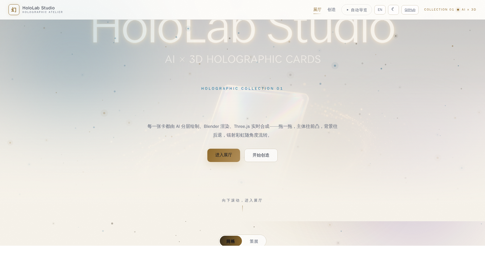
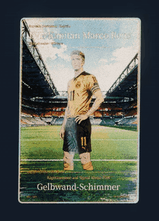
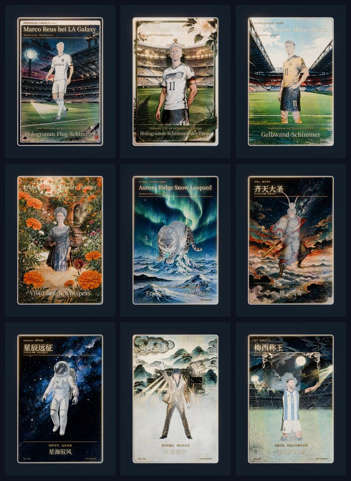
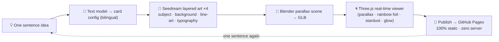

<p align="center">
  
</p>

<h1 align="center">🃏 HoloLab Studio ✨</h1>

<p align="center"><b>One sentence → a 3D holographic card → a live gallery playable by anyone on Earth.</b></p>

<p align="center">
  🌐 <a href="https://Elijah-Lin-Dancer.github.io/Holo-Card-Studio/"><b>https://Elijah-Lin-Dancer.github.io/Holo-Card-Studio/</b></a>
</p>

<p align="center">
  <a href="https://Elijah-Lin-Dancer.github.io/Holo-Card-Studio/"></a>
  <a href="https://opensource.org/licenses/MIT"></a>
  <a href="https://github.com/Elijah-Lin-Dancer/Holo-Card-Studio"></a>
  <a href="https://www.blender.org/"></a>
  <a href="https://threejs.org/"></a>
  <a href="https://Elijah-Lin-Dancer.github.io/Holo-Card-Studio/"></a>
  <a href="https://github.com/Elijah-Lin-Dancer/Holo-Card-Studio/actions"></a>
</p>

**English · [中文版](README.zh-CN.md)**

---

## 🚀 Live preview

> ### 🌐 **<https://Elijah-Lin-Dancer.github.io/Holo-Card-Studio/>**
> Drag the cards, flip them, watch the rainbow foil shift with the angle — no install, no account, no server.
>
> 🎨 **Create Studio** → **<https://Elijah-Lin-Dancer.github.io/Holo-Card-Studio/create.html>** — type one sentence and preview a card concept on the spot.

## ✨ What is this?

A complete **AIGC pipeline** that turns **one sentence** into an **interactive 3D holographic collectible card**:

| Step | What happens |
|---|---|
| 🧠 **Text model** | One sentence (auto-detects 中文 / Deutsch / English) → structured bilingual card config |
| 🎨 **AI layered art** | Doubao Seedream draws **4 layers** — subject · background · line-art · typography — divide & conquer |
| 🧊 **3D scene** | Blender builds the parallax / rainbow-foil scene, exports **GLB** |
| 🌀 **Live composite** | Three.js + GLSL shader renders parallax, rainbow foil, stardust & glow in the browser |
| 🚀 **Publish** | One command → pure-static GitHub Pages (zero server, zero database) |

*Portfolio project · AI × 3D intersection · vanilla JS front-end · zero frameworks*

## 🎴 See it move

| Demo — Marco Reus, "Gelbwand" (edition 007/009, German card face) |
|:--|
|  |

That's a **real turntable render** from the Blender pipeline (96 frames), not a mockup. The gallery plays it on hover; the detail page renders the live WebGL scene.

## 🗂️ The whole collection



**20 cards · 6 languages · every card a permanent URL**, openable and shareable by anyone:

- 🇦🇷 **Messi** series (4) — Barcelona · PSG · Inter Miami · World Cup 2022, plus the original *Messi, King* (梅西称王)
- 💙❤️ **FC Barcelona Legacy series** — Cruyff *El Arquitecto* · Guardiola *Tiki-Taka* (Spanish card faces)
- 🎤 **King of Pop** — Michael Jackson (English)
- 🖤💛 **Marco Reus** (3) — Dortmund *Gelbwand* · DFB *Unbeugsamer* · LA Galaxy *Neue Horizonte* (German card faces)
- 🎨 **Frida Kahlo** — Mexican painter (Spanish accents)
- 🎬 **Satyajit Ray** — Bengali maestro (Bengali card face)
- 🐎 **Neeltje** — a Friesian mare in Kalundborg, Denmark (Danish card face, **🔒 password-locked**)
- 🐋 **Blue Whale** — first community-submitted card via the auto-render pipeline
- 🚀 **Taikonaut** · 🐵 **Sun Wukong** · 🐆 **Snow Leopard** — one-sentence pipeline cards

Each card flips: a **structured back** with career stats · honors · quote, written in the card's own language.

## 💡 Why it's worth your time

This is not "tune an image model and output a picture" — it is a complete engineering chain that turns generative models into a **playable product**:

| Capability | Evidence in this repo |
|---|---|
| 🤖 **AI application** | Doubao Seedream API integration; **divide-and-conquer** layered generation (subject / background / line-art / typography); prompt engineering; image-to-image subject retention |
| 🧊 **3D graphics** | Blender procedural scenes (parallax UV, rainbow-foil material node group); glTF export; Three.js GLSL fragment shader that rebuilds the material in real time |
| ⚙️ **Systems engineering** | Python pipeline (generate → validate → render → export → publish); static site generation; one-command publish; CI-ready layout |
| 🎨 **Product design** | Masonry gallery, per-card permanent URLs, style filters, mobile adaptation, share-and-play |

## 🧩 Front-end showcase (latest)

The static pages are now a **dynamic interaction layer**:

- 🏠 **Homepage** — GSAP ScrollTrigger hero parallax (scrub), gold **shine sweep** across the split title (re-syncs on language switch), card **cursor-spotlight** + holographic **scan sweep** on hover, blur→sharp card entrance, **magnetic CTA buttons**, dual-theme stardust + aurora backdrop
- 🎥 **Auto Tour v2 — "Light Walk"** ✨ the gallery's signature experience: a **traveling golden beam** glides card-to-card (GSAP, power2.inOut), the focused card **comes alive** — title shine sweep, lenticular ripple, preview video auto-plays — a bottom **HUD** shows "N / total · card name", cards **wake up** staggered on start and the beam **curtains out** on finish; whole gallery breathes (4.5s); skips locked cards; disabled in curated view & reduced-motion
- 🗓️ **Curated timeline view** — every card has a bilingual creation note; the hall switches between masonry grid and an exhibition timeline
- 🔒 **Password-locked cards** — a locked card stays hidden in the hall until the right password unlocks it (SHA-256 hash in registry, no plaintext in source)
- 🛠️ **Create studio** — stardust + aurora backdrop matching the gallery, focus glow on the input panel, preview reveal animation; one-sentence → detailed design → save privately → request publish
- 🃏 **Card pages** — faint holographic halo + card rise-in animation, **dual theme** (dark stage / light cabinet) that follows your homepage theme
- 🌓 **Dual themes & fully bilingual UI** (EN / 中文) — including filter chips, lock prompts and tour controls; card faces keep their own language by design
- 📮 **Public submission** — community cards flow in via GitHub Issues → auto-render pipeline (review · 4-layer art · Blender GLB · preview.webm) → deployed to the hall, credited to the author
- ♿ Every effect respects `prefers-reduced-motion`; desktop-only interactions gated on fine-pointer

## ⚙️ Pipeline at a glance



## 🏃 Quick start

### 🖥️ Browse the gallery (no setup needed)

Just open the **Live Gallery** above. No account, no install, no server — it's pure static pages.

### 💻 Run the gallery locally

```bash
git clone https://github.com/Elijah-Lin-Dancer/Holo-Card-Studio.git
cd Holo-Card-Studio/gallery
python3 -m http.server 4191
# open http://127.0.0.1:4191
```

### 🎨 Make a card with one sentence (local pipeline)

**Requirements:** Blender 4.5 (portable build auto-downloads) · Node.js 18+ · Python 3.10+.

```bash
pip install -r generator/requirements.txt
```

**.env** (gitignored — never commit it):
```bash
ARK_API_KEY=your_doubao_ark_key
```

1️⃣ **Generate the card config from one sentence** (auto-detects 中文 / Deutsch / English):
```bash
python3 generator/scripts/one_shot_card.py "我想要一张凤凰"
python3 generator/scripts/one_shot_card.py "Ich möchte eine Hologramm-Karte von Marco Reus"   # → German card face
```

2️⃣ **Generate layered art → run the Blender pipeline → publish to gallery:**
```bash
python3 generator/scripts/ai_generate.py --project projects/<slug> --model doubao-seedream-5-0-flash-260915
python3 generator/scripts/run_pipeline.py --project projects/<slug>
python3 generator/scripts/publish_card.py --project projects/<slug> --tags "主题,标签"
```

3️⃣ **Ship it** — GitHub Actions deploys Pages automatically:
```bash
git add -A && git commit -m "add card <slug>" && git push
```

📷 **Reference-photo card** (pet, friend, character): place a photo in `generator/projects/<slug>/ref.png` — the pipeline generates from it directly.

🎛️ **Model defaults (locked):** image `doubao-seedream-5-0-flash-260915` · text `doubao-seed-2-0-mini-260428` · video `doubao-seedance-2-0-fast` (account not yet enabled).

## 📤 Submit your card to the public gallery

One sentence → your card goes live in the **public exhibition hall**, fully automated:

1. Open **Create studio** in the live gallery → type one sentence → generate the detailed description.
2. Tap **Save to my cards** (private, browser-only), then **Request publish**.
3. A prefilled **GitHub Issue** opens — add your name, hit *Submit new issue*.
4. The curation pipeline (GitHub Actions) runs automatically:
   - **Review** — length limits (idea ≤ 200 chars · design ≤ 4000) · language whitelist (中文 / English / Deutsch) · blocklist scan.
   - **Production render** — Seedream layered art (4 layers) → Blender 3D parallax → GLB → preview.webm → compressed assets.
   - **Ship** — the card is committed, deployed to Pages and the issue is closed with the live link.
5. Approved cards live in the public gallery **forever**, credited to you.

> No server, no database, no API keys in the browser — the pipeline runs entirely in GitHub Actions.

## 📁 Repository layout

```
Holo-Card-Studio/
├── gallery/                  # pure-static site (what gets deployed)
│   ├── index.html            # the exhibition hall 🖼️ (grid + curated timeline)
│   ├── create.html           # one-sentence create studio ✏️ (public submission entry)
│   ├── cards.json            # card registry (source of truth)
│   ├── curation.json         # bilingual creation notes (curated timeline, C1)
│   ├── i18n.js               # EN / 中文 UI dictionary (incl. filter chips & tour)
│   ├── cards/<id>/           # per-card: app.js · style.css · assets/ · card.glb · preview.webm · lent-L/R
│   └── vendor/               # three.js + GSAP, vendored locally — zero CDN dependency
├── generator/
│   ├── projects/<slug>/      # one folder per card: config, work/, web/, renders/
│   ├── tests/                # pytest suite (18 tests, C2)
│   └── scripts/
│       ├── one_shot_card.py  # text model → card config (zh/de/en/da/bn/es)
│       ├── ai_generate.py    # Seedream layered art + cutout + line-art
│       ├── run_pipeline.py   # Blender scene → GLB → preview
│       ├── publish_card.py   # compress · thumb · preview.webm · registry
│       ├── submit_card.py    # public submission: review · config · full pipeline
│       ├── inject_og.py      # per-card OG meta injection (C3)
│       └── verify_gallery.py # gallery health check (used by CI)
├── .github/workflows/
│   ├── deploy-pages.yml      # Pages deployment
│   └── gallery-check.yml     # CI: 18 pytest tests + gallery verify (C2)
├── tools/blender-4.5.0/      # portable Blender (gitignored)
├── docs/                     # architecture, AI pipeline, graphics, whitepaper
└── README.md
```

## 🖼️ Example cards

- 🇦🇷 **Messi, King** (梅西称王) — Argentina No.10 · Holographic Archive series
- 🎤 **King of Pop** (流行之王) — Michael Jackson · Legend series
- 🖤💛 **Gelbwand** (黄黑之魂) — Marco Reus · Borussia Dortmund · German card face
- 🏆 **Unbeugsamer** (未竟之约) — Marco Reus · DFB · WM 2014
- 🌌 **Neue Horizonte** (银河新章) — Marco Reus · LA Galaxy · MLS Cup champion
- 🎨 **Frida Kahlo** — Mexican painter · Archive series
- 🎬 **Satyajit Ray** (সত্যজিত রায়) — Bengali maestro · Bengali card face
- 🐎 **Neeltje** (hun Friese merrie) — Kalundborg, Denmark · Danish card face · 🔒 locked
- 🐋 **Blue Whale** — first community-submitted card (auto-render pipeline)
- 💙❤️ **Barcelona Legacy series** (6) — Messi ×4 eras · Cruyff · Guardiola · Spanish card faces
- 🚀 **Stellar Expedition** (星辰远征) — taikonaut · one-sentence pipeline
- 🐵 **Great Sage** (齐天大圣) — Sun Wukong · one-sentence pipeline
- 🐆 **Aurora Ridge** (雪原极光) — snow leopard · Frosted Wild series

## 🗺️ Roadmap

**Done ✅**
- [x] Seedream layered generation + cutout + line-art extraction
- [x] Blender holographic pipeline + Three.js viewer
- [x] One-sentence card pipeline + bilingual gallery + multilingual card faces (zh · en · de · da · bn · es)
- [x] Structured card backs (career stats · honors · quote)
- [x] Front-end interaction layer (parallax · shine · glow · magnetic CTA · dual themes)
- [x] **Public submission channel** — GitHub Issue → auto-render pipeline → live gallery (fully automated)
- [x] **C1 Curated timeline** — bilingual creation notes, exhibition view
- [x] **C2 CI** — 18 pytest tests + gallery health check, every push
- [x] **C3 OG meta** — per-card social preview injection
- [x] **Password-locked cards** — SHA-256 lock, unlock-in-hall UX
- [x] **Auto Tour v2 "Light Walk"** — traveling beam · card activation · HUD · intro/outro staging
- [x] Repository slimming (git gc 996M → 124M)

**Next 🚧**
- [ ] P5 demo video (Seedance 2.0 fast — account enablement pending on Volcano Ark)
- [ ] P6 Application-season research addendum (industry / product / paper evidence)
- [ ] P4.5 Whitepaper AI-flavor polish (optional)

## 📚 Docs

- [Architecture](docs/architecture.md) — system design & trade-offs
- [AI pipeline](docs/ai-pipeline.md) — layered generation in detail
- [Graphics](docs/graphics.md) — Blender nodes & GLSL shader notes
- [Deployment](docs/DEPLOYMENT.md) — Pages & Actions
- [Development plan](docs/DEVELOPMENT-PLAN.md)
- [Toolkit roadmap](docs/TOOLKIT-ROADMAP.md)
- [Whitepaper](docs/WHITEPAPER.md)

## 🙏 Acknowledgement

Built on top of the open-source [holo-card-studio](https://github.com/EverettFish/holo-card-studio) (MIT) — upstream credits retained.

## 📄 License

[MIT](LICENSE) — free to use, modify and share.
