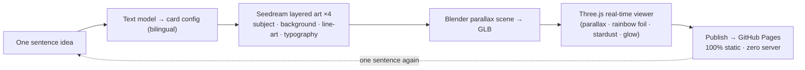

# HoloLab Studio ✨

**One sentence → a 3D holographic card that shifts with your gaze → a live gallery, playable by anyone on Earth.**

[](https://opensource.org/licenses/MIT)
[](https://Elijah-Lin-Dancer.github.io/Holo-Card-Studio/)
[](https://github.com/Elijah-Lin-Dancer/Holo-Card-Studio)
[](https://www.blender.org/)
[](https://threejs.org/)

**English · [中文版](README.zh-CN.md)**

---

**▶ [Live Gallery](https://Elijah-Lin-Dancer.github.io/Holo-Card-Studio/) — try the cards, drag them, flip them**  
**▶ [Create Studio](https://Elijah-Lin-Dancer.github.io/Holo-Card-Studio/create.html) — type one sentence, preview the concept**

A complete **AIGC pipeline** that turns one sentence into an interactive 3D holographic collectible card: Doubao Seedream draws the layered art, Blender builds the parallax / rainbow-foil 3D scene, Three.js composites it live in the browser — drag the card, push the subject forward, ease the background back, watch the rainbow foil shift with the angle. Cards publish to a pure-static gallery (GitHub Pages, zero server, zero database) with one command.

*Portfolio project · AI × 3D intersection · vanilla JS front-end · zero frameworks*

---

## See it move 🎴

| Demo — Marco Reus, "Gelbwand" (edition 007/009, German card face) | 
|:--|
|  |

That's a **real turntable render** from the Blender pipeline (96 frames), not a mockup. The gallery plays it on hover; the detail page renders the live WebGL scene.

## The whole collection


Messi · Michael Jackson · Marco Reus (×3) · Frida Kahlo · Snow Leopard · Sun Wukong · Taikonaut — each card is a permanent URL in the gallery.

---

## Why it's worth your time

This is not "tune an image model and output a picture" — it is a complete engineering chain that turns generative models into a playable product:

| Capability | Evidence in this repo |
|---|---|
| **AI application** | Doubao Seedream API integration; **divide-and-conquer** layered generation (subject / background / line-art / typography); prompt engineering; image-to-image subject retention |
| **3D graphics** | Blender procedural scenes (parallax UV, rainbow-foil material node group); glTF export; Three.js GLSL fragment shader that rebuilds the material in real time |
| **Systems engineering** | Python pipeline (generate → validate → render → export → publish); static site generation; one-command publish; CI-ready layout |
| **Product design** | Masonry gallery, per-card permanent URLs, style filters, mobile adaptation, share-and-play |

## Front-end showcase (v3) ✨

The latest pass turned the static pages into a **dynamic interaction layer**:

- **Homepage** — GSAP ScrollTrigger hero parallax (scrub), gold **shine sweep** across the split title (re-syncs on language switch), card **cursor-spotlight** + holographic **scan sweep** on hover, blur→sharp card entrance, **magnetic CTA buttons**
- **Create studio** — stardust + aurora backdrop matching the gallery, focus glow on the input panel, preview reveal animation
- **Card pages** — faint holographic halo (keeps the print-white aesthetic) + card rise-in animation
- Dual themes (dark stage / light cabinet), bilingual UI (EN / 中文), stardust particles, aurora, cursor glow, per-letter title reveal, staggered card entrance with tilt — all vanilla JS + GSAP, zero frameworks, zero backend
- Every effect respects `prefers-reduced-motion`; desktop-only interactions gated on fine-pointer

## Pipeline at a glance



---

## Quick start

### Browse the gallery (no setup needed)

Just open the **Live Gallery** above. No account, no install, no server.

### Run the gallery locally

```bash
git clone https://github.com/Elijah-Lin-Dancer/Holo-Card-Studio.git
cd Holo-Card-Studio/gallery
python3 -m http.server 4191
# open http://127.0.0.1:4191
```

### Make a card with one sentence (local pipeline)

# 1. Requirements
Blender 4.5 (portable build auto-downloads), Node.js 18+, Python 3.10+.

# .env (gitignored — never commit it)
ARK_API_KEY=your_doubao_ark_key

# 2. Generate the card config from one sentence (auto-detects 中文 / Deutsch / English)
python3 generator/scripts/one_shot_card.py "我想要一张凤凰"
python3 generator/scripts/one_shot_card.py "Ich möchte eine Hologramm-Karte von Marco Reus"   # → German card face

# 3. Generate layered art → run the Blender pipeline → publish to gallery
python3 generator/scripts/ai_generate.py --project projects/<slug> --model doubao-seedream-5-0-flash-260915
python3 generator/scripts/run_pipeline.py --project projects/<slug>
python3 generator/scripts/publish_card.py --project projects/<slug> --tags "主题,标签"

git add -A && git commit -m "add card <slug>" && git push   # GitHub Actions deploys Pages automatically

**Reference-photo card** (pet, friend, character): place a photo in `generator/projects/<slug>/ref.png` — the pipeline generates from it directly.

**Model defaults (locked):** image `doubao-seedream-5-0-flash-260915` · text `doubao-seed-2-0-mini-260428` · video `doubao-seedance-2-0-fast` (account not yet enabled).

---

## Repository layout

```
Holo-Card-Studio/
├── gallery/                  # pure-static site (what gets deployed)
│   ├── index.html            # the exhibition hall
│   ├── create.html           # one-sentence create studio
│   ├── cards.json            # card registry (source of truth)
│   ├── cards/<id>/           # per-card: app.js · style.css · assets/ · card.glb · preview.webm · lent-L/R
│   └── vendor/               # three.js + GSAP, vendored locally — zero CDN dependency
├── generator/
│   ├── projects/<slug>/      # one folder per card: config, work/, web/, renders/
│   └── scripts/
│       ├── one_shot_card.py  # text model → card config (zh/de/en)
│       ├── ai_generate.py    # Seedream layered art + cutout + line-art
│       ├── run_pipeline.py   # Blender scene → GLB → preview
│       └── publish_card.py   # compress · thumb · preview.webm · registry
├── tools/blender-4.5.0/      # portable Blender (gitignored)
├── docs/                     # architecture, AI pipeline, graphics, whitepaper
└── README.md
```

---

## Example cards

- **Messi, King** (梅西称王) — Argentina No.10 · Holographic Archive series
- **King of Pop** (流行之王) — Michael Jackson · Legend series
- **Gelbwand** (黄黑之魂) — Marco Reus · Borussia Dortmund · German card face
- **Unbeugsamer** (未竟之约) — Marco Reus · DFB · WM 2014
- **Neue Horizonte** (银河新章) — Marco Reus · LA Galaxy · MLS Cup champion
- **Frida Kahlo** — Mexican painter · Archive series
- **Stellar Expedition** (星辰远征) — taikonaut · one-sentence pipeline
- **Great Sage** (齐天大圣) — Sun Wukong · Journey to the West series · one-sentence pipeline
- **Aurora Ridge** (雪原极光) — snow leopard · Frosted Wild series

---

## Roadmap

- [x] Seedream layered generation + cutout + line-art extraction
- [x] Blender holographic pipeline + Three.js viewer
- [x] One-sentence card pipeline (zh) + bilingual gallery
- [x] German card faces (auto language detection)
- [x] Structured card backs (career stats · honors · quote)
- [x] Front-end interaction layer v3 (parallax · shine · glow · magnetic CTA)
- [x] Repository slimming (git gc 996M → 124M)
- [ ] Visitor public-submission channel (design drafted, awaiting implementation)
- [ ] Application-season research addendum (P6)

## Docs

- [Architecture](docs/architecture.md) — system design & trade-offs
- [AI pipeline](docs/ai-pipeline.md) — layered generation in detail
- [Graphics](docs/graphics.md) — Blender nodes & GLSL shader notes
- [Deployment](docs/DEPLOYMENT.md) — Pages & Actions
- [Development plan](docs/DEVELOPMENT-PLAN.md)
- [Toolkit roadmap](docs/TOOLKIT-ROADMAP.md)
- [Whitepaper](docs/WHITEPAPER.md)

## Acknowledgement

Built on top of the open-source [holo-card-studio](https://github.com/EverettFish/holo-card-studio) (MIT) — upstream credits retained.

## License

[MIT](LICENSE) — free to use, modify and share.
