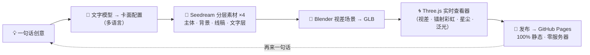

<p align="center">
  
</p>

<h1 align="center">🃏 HoloLab Studio ✨</h1>

<p align="center"><b>一句话 → 一张随视线流动光影的 3D 全息卡 → 一个全世界任何人都能打开的在线展厅。</b></p>

<p align="center">
  🌐 <a href="https://Elijah-Lin-Dancer.github.io/Holo-Card-Studio/"><b>https://Elijah-Lin-Dancer.github.io/Holo-Card-Studio/</b></a>
</p>

<p align="center">
  <a href="https://Elijah-Lin-Dancer.github.io/Holo-Card-Studio/"></a>
  <a href="https://opensource.org/licenses/MIT"></a>
  <a href="#"></a>
  <a href="https://www.blender.org/"></a>
  <a href="https://threejs.org/"></a>
  <a href="#"></a>
</p>

**中文 · [English](README.md)**

---

## 🚀 在线预览

> ### 🌐 **<https://Elijah-Lin-Dancer.github.io/Holo-Card-Studio/>**
> 拖动卡片、翻转、看镭射彩虹随角度流转——无需安装、无需账号、无需服务器。
>
> 🎨 **创造工坊** → **<https://Elijah-Lin-Dancer.github.io/Holo-Card-Studio/create.html>** — 输入一句话，当场预览概念卡。

## ✨ 这是什么？

一条完整的 **AIGC 管线**，把**一句话**变成一张**可交互的 3D 全息收藏卡**：

| 步骤 | 发生了什么 |
|---|---|
| 🧠 **文字模型** | 一句话（自动识别 中文 / Deutsch / English）→ 结构化双语卡面配置 |
| 🎨 **AI 分层素材** | 豆包 Seedream 分层绘制 **4 层** — 主体 · 背景 · 线稿 · 文字层 — 分而治之 |
| 🧊 **3D 场景** | Blender 构建视差 / 镭射彩虹场景，导出 **GLB** |
| 🌀 **实时合成** | Three.js + GLSL 着色器在浏览器实时渲染视差、镭射彩虹、星尘与泛光 |
| 🚀 **发布** | 一条命令 → 纯静态 GitHub Pages（零服务器、零数据库） |

*作品集项目 · AI × 3D 交叉方向 · 原生 JS 前端 · 零框架*

## 🎴 会动的卡片

| 演示 — 马尔科·罗伊斯「黄黑之魂」（edition 007/009，德语卡面） |
|:--|
|  |

这是 Blender 管线输出的**真实转台渲染**（96 帧），不是效果图。展厅里悬停播放、详情页实时渲染 WebGL 场景。

## 🗂️ 完整收藏


梅西 · 迈克尔·杰克逊 · 马尔科·罗伊斯（×3）· 弗里达·卡罗 · 雪豹 · 孙悟空 · 宇航员——每一张卡都是展厅里的一个**永久链接**，任何人都能打开、分享。

## 💡 为什么值得你看

这不是"调一个图像模型出一张图"——它是一条把生成模型变成**可玩产品**的完整工程链：

| 能力 | 仓库里的证据 |
|---|---|
| 🤖 **AI 应用** | 豆包 Seedream API 集成；**分而治之**的分层生成（主体 / 背景 / 线稿 / 文字层）；提示词工程；图生图主体保持 |
| 🧊 **3D 图形学** | Blender 程序化场景（视差 UV、镭射彩虹材质节点组）；glTF 导出；Three.js GLSL 片元着色器实时重建材质 |
| ⚙️ **系统工程** | Python 管线（生成 → 校验 → 渲染 → 导出 → 发布）；静态站点生成；一条命令发布；CI 就绪布局 |
| 🎨 **产品设计** | 瀑布流展厅、每卡永久 URL、风格筛选、移动端适配、即玩即分享 |

## 🧩 前端展示（v3）

最近一轮把静态页面升级成了**动态交互层**：

- 🏠 **首页** — GSAP ScrollTrigger 滚动视差（scrub），标题金色**流光扫字**（切换语言自动重扫），卡片悬停**光斑跟随** + 全息**镭射扫过**，blur→清晰卡片入场，CTA **磁吸按钮**
- 🛠️ **创造工坊** — 与展厅统一的星尘 + 极光背景，输入面板聚焦光晕，预演区浮现动画
- 🃏 **卡片详情页** — 极淡全息光晕 + 卡片浮起入场动画，**双主题**（暗色舞台 / 浅色展柜）跟随首页主题
- 🌓 **双主题 & 双语界面**（中文 / EN）、星尘粒子、极光、光标光晕、逐字标题入场、卡片倾斜 stagger——全部原生 JS + GSAP，零框架、零后端
- ♿ 所有动效尊重 `prefers-reduced-motion`；桌面专属交互按精细指针门控

## ⚙️ 管线一览



## 🏃 快速开始

### 🖥️ 直接逛展厅（无需任何配置）

打开上面的**在线预览**即可。无需账号、无需安装、无需服务器——它是纯静态页面。

### 💻 本地跑展厅

```bash
git clone https://github.com/Elijah-Lin-Dancer/Holo-Card-Studio.git
cd Holo-Card-Studio/gallery
python3 -m http.server 4191
# 打开 http://127.0.0.1:4191
```

### 🎨 一句话造一张卡（本地管线）

**环境要求：** Blender 4.5（便携版自动下载）· Node.js 18+ · Python 3.10+。

**.env**（已 gitignore，切勿提交）：
```bash
ARK_API_KEY=你的_豆包_ark_key
```

1️⃣ **一句话生成卡面配置**（自动识别 中文 / Deutsch / English）：
```bash
python3 generator/scripts/one_shot_card.py "我想要一张凤凰"
python3 generator/scripts/one_shot_card.py "Ich möchte eine Hologramm-Karte von Marco Reus"   # → 德语卡面
```

2️⃣ **分层素材 → Blender 管线 → 发布到展厅：**
```bash
python3 generator/scripts/ai_generate.py --project projects/<slug> --model doubao-seedream-5-0-flash-260915
python3 generator/scripts/run_pipeline.py --project projects/<slug>
python3 generator/scripts/publish_card.py --project projects/<slug> --tags "主题,标签"
```

3️⃣ **推送上线** — GitHub Actions 自动部署 Pages：
```bash
git add -A && git commit -m "add card <slug>" && git push
```

📷 **参考照做卡**（宠物、朋友、角色）：把照片放到 `generator/projects/<slug>/ref.png`，管线直接参考生成。

🎛️ **模型选型（已锁定）：** 图片 `doubao-seedream-5-0-flash-260915` · 文字 `doubao-seed-2-0-mini-260428` · 视频 `doubao-seedance-2-0-fast`（账号尚未开通）。

## 📁 仓库结构

```
Holo-Card-Studio/
├── gallery/                  # 纯静态站点（线上部署的就是它）
│   ├── index.html            # 展厅首页 🖼️
│   ├── create.html           # 一句话创造工坊 ✏️
│   ├── cards.json            # 卡片清单（唯一事实源）
│   ├── cards/<id>/           # 每卡：app.js · style.css · assets/ · card.glb · preview.webm · lent-L/R
│   └── vendor/               # three.js + GSAP 本地化，零 CDN 依赖
├── generator/
│   ├── projects/<slug>/      # 每卡一个目录：config, work/, web/, renders/
│   └── scripts/
│       ├── one_shot_card.py  # 文字模型 → 卡面配置（zh/de/en）
│       ├── ai_generate.py    # Seedream 分层素材 + 抠图 + 线稿
│       ├── run_pipeline.py   # Blender 场景 → GLB → 预览
│       └── publish_card.py   # 压缩 · 缩略图 · 预览动画 · 登记
├── tools/blender-4.5.0/      # 便携版 Blender（gitignored）
├── docs/                     # 架构、AI 管线、图形学、白皮书
└── README.md
```

## 🖼️ 示例卡片

- 🇦🇷 **梅西称王** — 阿根廷十号 · 全息典藏系列
- 🎤 **流行之王** — 迈克尔·杰克逊 · 传奇系列
- 🖤💛 **黄黑之魂** — 马尔科·罗伊斯 · 多特蒙德 · 德语卡面
- 🏆 **未竟之约** — 马尔科·罗伊斯 · 德国国家队 · 2014 世界杯
- 🌌 **银河新章** — 马尔科·罗伊斯 · 洛杉矶银河 · MLS 杯冠军
- 🎨 **弗里达·卡罗** — 墨西哥画家 · 典藏系列
- 🚀 **星辰远征** — 宇航员 · 一句话管线生成
- 🐵 **齐天大圣** — 孙悟空 · 西游系列 · 一句话管线生成
- 🐆 **雪原极光** — 雪豹 · 霜原野生系列

## 🗺️ 路线图

- [x] ✅ Seedream 分层生成 + 抠图 + 线稿提取
- [x] ✅ Blender 全息管线 + Three.js 查看器
- [x] ✅ 一句话出卡（中文）+ 双语展厅
- [x] ✅ 德语卡面（自动语言识别）
- [x] ✅ 结构化卡背（生涯数据 · 荣誉 · 引语）
- [x] ✅ 前端交互层 v3（视差 · 流光 · 光斑 · 磁吸）
- [x] ✅ 详情页双主题 + 社交二维码页脚
- [x] ✅ 仓库瘦身（git gc 996M → 124M）
- [ ] 🚧 访客公开投稿通道（方案已出，待落地）
- [ ] 📝 申请季研究综述（P6）

## 📚 文档

- [架构设计](docs/architecture.md) — 系统设计与权衡
- [AI 管线](docs/ai-pipeline.md) — 分层生成详解
- [图形学](docs/graphics.md) — Blender 节点与 GLSL 着色器笔记
- [部署](docs/DEPLOYMENT.md) — Pages 与 Actions
- [开发计划](docs/DEVELOPMENT-PLAN.md)
- [工具路线图](docs/TOOLKIT-ROADMAP.md)
- [白皮书](docs/WHITEPAPER.md)

## 🙏 致谢

基于开源项目 [holo-card-studio](https://github.com/EverettFish/holo-card-studio)（MIT）二次开发，保留上游署名。

## 📄 许可

[MIT](LICENSE) — 自由使用、修改与分享。
