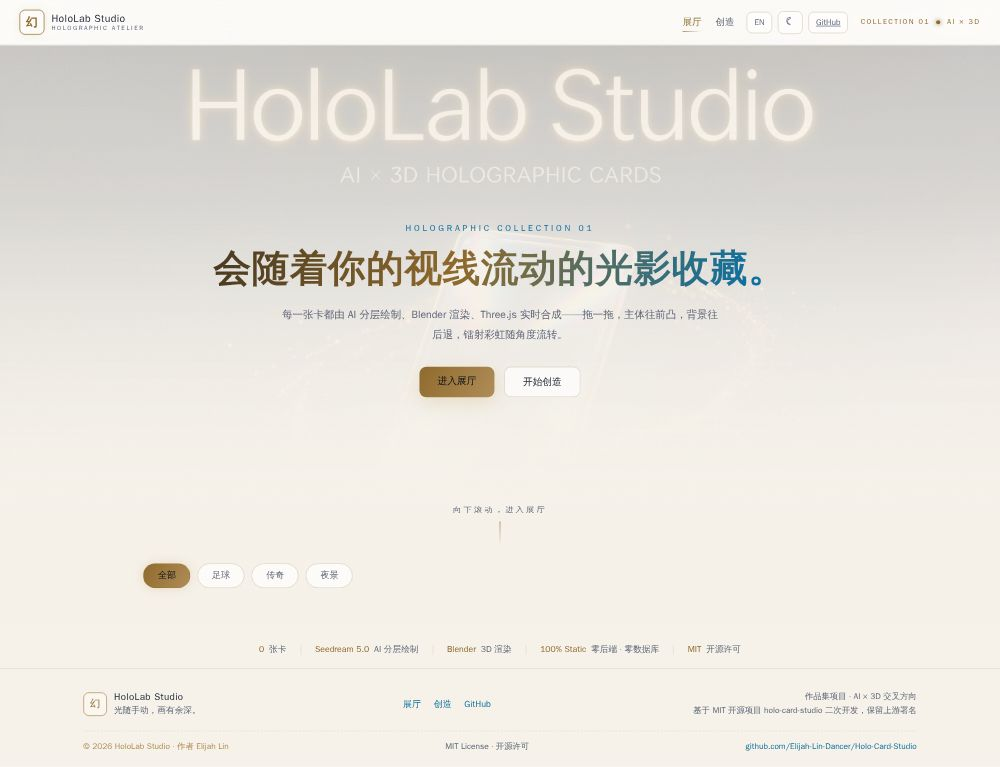
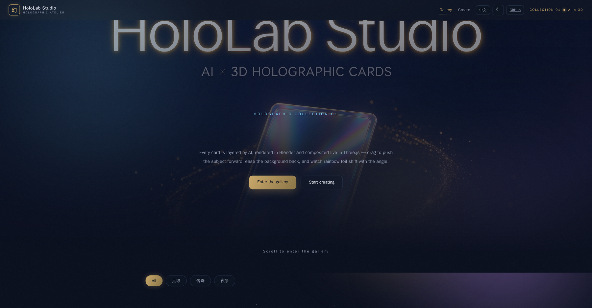
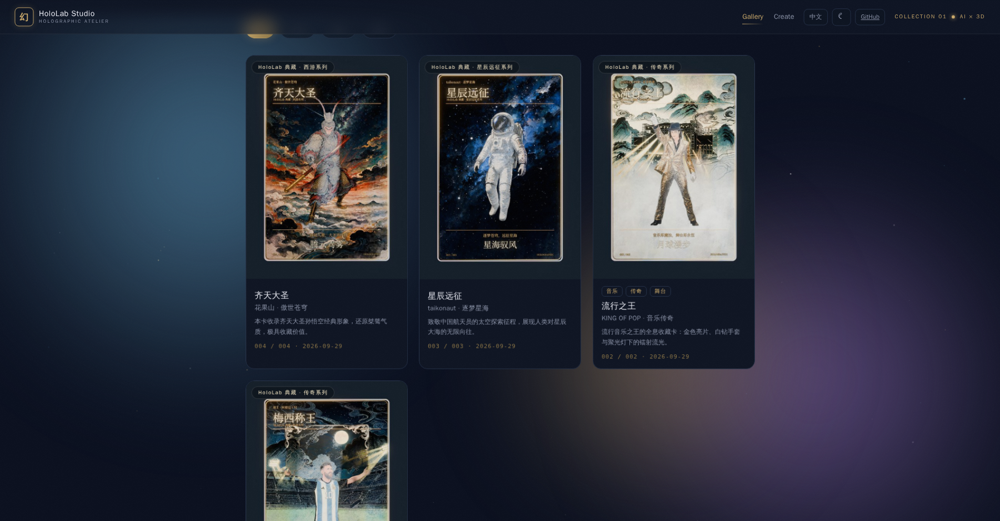

# HoloLab Studio

**中文 · [English](README.md)**

> 一句话 → 一张会随视线流动光影的 3D 全息卡 → 一个全球可玩的在线展厅。

**▶ [在线展厅（Live Gallery）](https://Elijah-Lin-Dancer.github.io/Holo-Card-Studio/)**

一条完整的 **AIGC 全链路系统**：用豆包 Seedream 图像生成模型把一句话（或一张参考照片）分层绘制成卡面素材，交给 Blender 构建带视差/镭射的 3D 场景，导出 GLB 后在浏览器里用 Three.js 实时合成——主体往前凸、背景往后缩、镭射彩虹随角度流转。生成好的卡片通过一键发布脚本进入纯静态展厅（GitHub Pages 托管，零服务器、零数据库），任何人打开链接即可拖拽、翻面、调节光影。

*作品集项目 · AI × 3D 交叉方向 · 前端 100% 静态*

| | |
|---|---|
| **分层素材** | 豆包 Seedream 5.0（Flash）+ rembg 抠图 + OpenCV 线稿提取 |
| **3D 管线** | Blender 4.5（自动下载便携版）→ glTF 导出 |
| **实时渲染** | Three.js + GLSL 着色器（视差 / 镭射 / 星光 / 辉光） |

---

## 界面截图

浅色主题 · 全页：



深色主题 · Hero（已去除浮动卡，居中文案）：



深色主题 · 卡片墙：



---

## 为什么值得看

这个项目不是"调一个图像模型出张图"，而是一条把生成模型真正落地成可玩产品的完整工程链路：

| 能力维度 | 具体体现 |
|---|---|
| **AI 应用开发** | 豆包 Seedream API 集成；主体/背景/线稿/文字四层**分而治之**的生成策略；提示词工程；以图生图保留主体 |
| **3D 图形学** | Blender 程序化场景（视差 UV、镭射材质节点组）；glTF 导出；Three.js GLSL 片段着色器实时重建材质 |
| **系统工程** | Python 流水线（生成 → 校验 → 渲染 → 导出 → 发布）；静态站点生成；一键发布脚本；CI/CD 就绪 |
| **产品设计** | 瀑布流展厅、每卡永久 URL、风格筛选、移动端适配、分享即玩 |

**前端展示（v2）：** 双主题（深色舞台 / 浅色展柜）、双语界面（中文 / EN）、星尘粒子、极光、光标光晕、标题逐字揭示、卡片交错入场 + tilt 倾斜、玻璃拟态筛选——全部原生 JS，零框架、零后端。

---

## 系统架构

```
┌─────────────────────────── 本地工具链 ───────────────────────────┐
│  一句话 / 一张照片                                                 │
│     │                                                            │
│     ▼                                                            │
│  ai_generate.py（豆包 Seedream 5.0）                              │
│     ├─ 主体层 subject.png   生成 → rembg 抠图 → 透明底 PNG        │
│     ├─ 背景层 background.png 同风格环境空镜（中下部留白叠字）      │
│     ├─ 线稿层 lineart.png   OpenCV 从透明主体提取轮廓（像素级注册）│
│     └─ 文字层 text.png      精确字体排版（不让 AI 画字）          │
│     │                                                            │
│     ▼                                                            │
│  run_pipeline.py（Blender 4.5 自动下载 + SHA-256 校验）           │
│     ├─ card.blend            可编辑的 3D 场景                     │
│     ├─ renders/hero.png      Cycles 渲染正面图                    │
│     └─ web/                  Three.js 查看器 + card.glb           │
│     │                                                            │
│     ▼                                                            │
│  publish_card.py（一键发布：WebP 压缩 + 预览动画 + 清单，幂等）    │
└───────────────────────────┬──────────────────────────────────────┘
                           │ git push（纯静态，零后端）
                           ▼
        GitHub Pages 在线展厅（瀑布流 + 筛选 + 每卡独立 URL）
```

---

## 功能特性

- **一句话自动出卡** — 输入一句想法，本地扩写引擎把它展开为结构化详细描述（主体/背景/色调/线稿/文字五段），生成前可自由修改。
- **卡面语言跟随输入** — 你输入什么语言，卡面文字就是什么语言（CJK 判中文，其余一律英文兜底），前端扩写与本地 `one_shot_card.py` 两端一致。
- **展厅** — 瀑布流卡片墙 + 风格筛选（全部/足球/传奇/夜景）、每卡独立 URL、拖拽视差。
- **创造工坊** — 双输入框（一句话想法 → 生成详细描述 → 可编辑），本地预演，浏览器端零 API 调用（密钥绝不进入前端）。
- **双主题 + 双语界面** — 深色/浅色、中文/EN，支持 `?lang=` 分享链接强制语言。

---

## 快速开始

### 浏览展厅（无需任何配置）

打开 **[https://Elijah-Lin-Dancer.github.io/Holo-Card-Studio/](https://Elijah-Lin-Dancer.github.io/Holo-Card-Studio/)** — 纯静态。

### 本地运行展厅

```bash
cd gallery && python3 -m http.server 8000   # 打开 http://127.0.0.1:8000
```

### 一句话做一张卡（本地管线）

```bash
# 1. 环境
pip install pillow opencv-python-headless rembg onnxruntime
# .env（已被 .gitignore 忽略，勿提交）
ARK_API_KEY=你的密钥

# 2. 一句话生成卡配置
python3 generator/scripts/one_shot_card.py "给中国航天员设计一张全息收藏卡"

# 3. 分层出图 → Blender 管线 → 发布进展厅
python3 generator/scripts/ai_generate.py --project generator/projects/<id>
python3 generator/scripts/run_pipeline.py  --project generator/projects/<id>
python3 generator/scripts/publish_card.py  --project generator/projects/<id> --id <id> --tags "风格,题材"
```

发布阶段全自动：四层贴图 PNG→WebP 压缩（−81%）、Blender 旋转序列 96 帧 → `preview.webm` 预览动画、更新 `cards.json` 清单——无需任何手动压缩/渲染步骤。重跑幂等（`--skip-preview` 可跳过动画渲染）。

Blender **无需手动安装**：流水线会自动下载官方便携版到 `<项目>/tools/` 并校验 SHA-256。

**参考图卡**（宠物、朋友、角色）：

```bash
python3 generator/scripts/ai_generate.py --project generator/projects/<id> --reference 照片路径
```

Seedream 会保留照片中主体的姿态与构图，重绘为卡牌风格。

**模型选型（已锁定）：** 图片 `doubao-seedream-5-0-flash-260915` · 文字 `doubao-seed-2-0-mini-260428` · 视频 `doubao-seedance-2-0-fast`（账号暂未开通）。

---

## 目录结构

```
holo-lab/
├── gallery/                      # 纯静态前端（index/create/theme/i18n/cards.json）
│   ├── index.html                # 瀑布流首页
│   ├── create.html               # 创造工坊（双输入框）
│   ├── cards.json                # 卡片清单（JSON 驱动，无数据库）
│   └── cards/<card-id>/          # 每张卡资产：thumb.jpg · card.jpg · scene.glb
├── generator/
│   ├── scripts/
│   │   ├── one_shot_card.py      # 一句话出卡（支持语言跟随）
│   │   ├── ai_generate.py        # 豆包 Seedream 分层画图（核心增量）
│   │   ├── run_pipeline.py       # 流水线编排（Blender 构建/渲染/导出）
│   │   ├── build_card.py         # Blender 程序化场景 + 材质节点
│   │   ├── export_web.py         # glTF/GLB 导出
│   │   ├── generate_typography.py# 文字层精确排版
│   │   ├── validate_assets.py    # 四层素材体检
│   │   ├── ensure_blender.py     # Blender 自动下载 + SHA-256
│   │   ├── render_preview.py     # 旋转预览帧渲染（360×500 / 96 帧）
│   │   ├── publish_card.py       # 一键发布（核心增量）
│   │   └── web-template-holographic/  # Three.js 查看器模板
│   └── projects/<card-id>/       # 每张卡的项目目录
├── docs/                         # 架构 · AI 管线 · 图形学 · 白皮书
└── .github/workflows/deploy.yml  # CI 自动部署
```

---

## 示例卡

- 「梅西称王」—— 球王 · 阿根廷十号 · 全息典藏系列
- 「流行之王」—— 迈克尔·杰克逊 · 舞台之巅 · 传奇系列
- 「星辰远征」—— 中国航天员 · 逐梦星海 · 星辰远征系列（一句话自动出卡生成）
- 「齐天大圣」—— 孙悟空 · 傲世苍穹 · 西游系列（一句话自动出卡生成）

---

## 路线图

- [x] 豆包 Seedream 分层生成 + 抠图 + 线稿提取
- [x] Blender 全息流水线 + Three.js 查看器
- [x] 静态展厅 + 一键发布 + CI 部署就绪
- [x] 素材体积压缩（PNG→WebP，−81%，已入发布流水线）
- [x] 卡片动态预览（Blender 旋转序列 → preview.webm + hover 播放）
- [x] 一句话自动出卡（文字模型 → 配置 → 全自动闭环）
- [x] 卡面语言跟随输入（CJK / 英文兜底）
- [ ] lenticular 双图光栅模式接入
- [ ] 展厅自动分类（按人物/风格/稀有度）

---

## 深入阅读

- [`docs/architecture.md`](docs/architecture.md) —— 系统设计与分层决策
- [`docs/ai-pipeline.md`](docs/ai-pipeline.md) —— 四层生成策略、提示词工程、抠图与线稿提取
- [`docs/graphics.md`](docs/graphics.md) —— 视差 UV、镭射材质、GLSL 着色器原理
- [`docs/DEPLOYMENT.md`](docs/DEPLOYMENT.md) —— 上线步骤
- [白皮书](docs/whitepaper/deliverables/final.md)
- [工具清单](docs/TOOLKIT-ROADMAP.md)

---

## 开源声明

本项目在开源项目 [EverettFish/holo-card-studio](https://github.com/EverettFish/holo-card-studio)（MIT License）基础上二次开发，保留上游署名。个人增量包括：**AI 分层画图自动化**（原项目依赖 Codex 人工调用图像模型，本项目改为可复现的豆包 API 管线）、**OpenCV 线稿提取**、**一键发布与静态展厅系统**、**部署与文档体系**。Blender 场景构建脚本沿用原项目实现，素材规范兼容原项目格式。卡面插画由豆包 Seedream 生成，3D 场景由 Blender 渲染。

## License

MIT © 2026 HoloLab Studio · 作者 Elijah Lin
